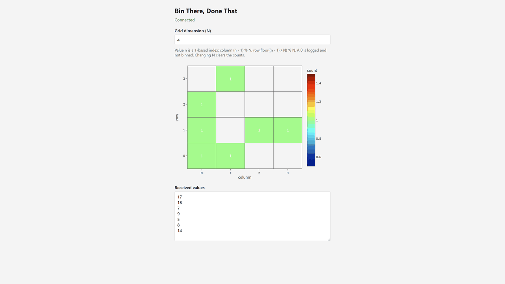

# Bin There, Done That

Private repo: [https://github.com/Brian-Pho/Bin-There-Done-That](https://github.com/Brian-Pho/Bin-There-Done-That)

Precision Neuroscience full-stack exercise: stream nonnegative integers from a cloud-style data server and visualize them as a real-time NxN heatmap on a local web client.

## Approach

**Chosen: Socket.IO integer stream, client-side binning, Plotly heatmap** (Approach 1).

When a client connects, the server starts a **per-socket continuous stream** of nonnegative integers in `[0, MAX_VALUE)` (`MAX_VALUE` is `20` in `server/src/index.mjs`). It emits a `number` event once per second. Disconnecting that client stops its timer. Independent clients get independent streams.

The client connects over Socket.IO, lets you set **N** (whole number from 1 to 40), bins incoming integers into an NxN count grid in React state, and renders that grid with **Plotly.js** (`react-plotly.js`):

- Keep the **NxN count grid in React state**
- On each `number`, treat **n as a 1-based cell index**, then unpack with zero-based remainder and quotient (row-major, wrapping every `N²` cells):
  - `0` is logged and skipped by `binning.js` (not binned)
  - `index = n - 1`
  - `col = index % N`
  - `row = Math.floor(index / N) % N`
  - increment that cell and store a **new** grid (do not mutate in place)
- Pass the grid to Plotly as heatmap `z` so `react-plotly.js` calls `Plotly.react` when state updates
- Color cells with a conventional **blue-to-red** `colorscale`, normalized to the current maximum count (zero-count cells stay uncolored)
- Update `zmin`/`zmax` (or Plotly autoscale) as the max count changes
- Changing N clears the counts and the received-values log

On a 4×4 grid this matches the spec examples: `17 → <0, 0>` (`index = 16`) and `8 → <1, 3>` (`index = 7`).

### Alternatives considered

- **SSE:** HTTP-native one-way stream; extra REST needed to control N or pause. Not used so the project can follow the same Socket.IO split as [Chat-App](https://github.com/Brian-Pho/Chat-App).
- **Server-side binning:** server holds the grid and sends snapshots/deltas. Better fit for a later server-side rendering discussion; weaker if the client should interpret the raw integer stream.
- **ECharts or D3 for the heatmap:** ECharts has a strong `visualMap`; D3 + Canvas is more control and a smoother 3D path. Plotly is the chosen heatmap library for a built-in heatmap trace, colorscale, and colorbar.

### Bonus (discussion only)

- **3D:** use cubes to display counts. Same NxN counts; color still from the normalized count.
- **Server-side rendering:** the server does binning and heatmap generation. That trades reduced client CPU usage for more data sent between server and client. Sending pixels/frames instead of integers or counts also costs bandwidth and latency and weakens interactivity (changing N, inspecting cells).

## FAQ

1. How to handle "0"?
   1. The server streams nonnegative integers to the client, which includes zero. Since there's no bin for zero, I've decided to drop it on the client.
   2. An alternative is to bin it at `<N,N>` since that's where the formula calculates zero's position, or to display it as an exception.
2. What happens when the client loses the connection to the server?
   1. The client displays "Disconnected" at the top and freezes the data. When the client reconnects, the data starts streaming again.
3. Can multiple clients run simultaneously?
   1. Yes, each client has a separate connection with the server and receives its own stream of numbers.
4. How is data generated?
   1. The server has a hardcoded upper limit (`MAX_VALUE`) and generates random numbers in `[0, MAX_VALUE)`.
5. What's the connection protocol between the client and server?
   1. I use [socket.io](https://socket.io/) for bidirectional and low-latency communication between client and server. The underlying connection is WebSocket with fall back to HTTP [long-polling](https://javascript.info/long-polling).
   2. The connection is simple, performant, and scalable.
6. What's the visualization library?
   1. I use [plotly.js](https://plotly.com/javascript/) because it's simple and I have experience with it. If I need more control over the visualization, alternatives would be D3 or custom React components.

## Run the server

1. `cd server`
2. `npm ci`
3. `npm start`

The server listens on [http://localhost:3001/](http://localhost:3001/) by default (`PORT` env var to override). Use `npm run watch` while editing. With the server running, `npm run verify` connects over Socket.IO, reads 3 numbers, then disconnects (`SERVER_URL` if not on 3001).

## Run the client

1. `cd client`
2. `npm ci`
3. `npm start`

The client is at [http://localhost:3000/](http://localhost:3000/). The data server must already be running.
